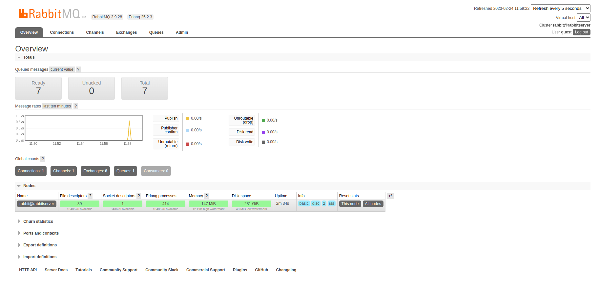
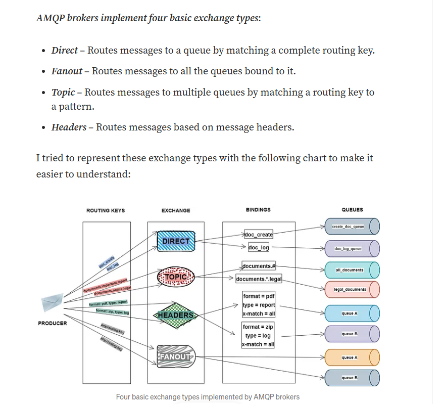

# POC RabbitMQ : RabbitMQ server and spring boot application producer
Rabbit MQ inspired from :  
basics :  
https://www.youtube.com/watch?v=5kxLeR_YuIk  
https://github.com/dailycodebuffer/Spring-MVC-Tutorials/tree/master/spring-rabbitmq-producer  
https://github.com/dailycodebuffer/Spring-MVC-Tutorials/tree/master/spring-rabbitmq-consumer  

advanced :  
https://medium.com/trendyol-tech/rabbitmq-exchange-types-d7e1f51ec825  

Note : the application to consume messages is reachable at :  
https://github.com/skeres/rabbitMQ-consumer  

## Versions used for this POC
**system**
Ubuntu 22.04  

**docker :**  
Client: Docker Engine - Community  
Version:           23.0.1  
API version:       1.42  
Go version:        go1.19.5  
Git commit:        a5ee5b1  
Built:             Thu Feb  9 19:47:01 2023  
OS/Arch:           linux/amd64  
Context:           default  

**docker-compose :**  
docker-compose version 1.25.5, build 8a1c60f6  
docker-py version: 4.1.0  
CPython version: 3.7.5  
OpenSSL version: OpenSSL 1.1.0l  10 Sep 2019  

**spring boot :**  
version : 2.7.8  
This version support java 11. If you want to use spring boot version 3.0.0 or higher, you must use java 17  

**RabbitMQ :**  
image : rabbitmq:3.9.28-management  

## Requirements
docker  
docker-compose  
java 11 JDK  

## Spring on https://start.spring.io/
If you want to generate your project from scratch with spring initialzr, select these items :   
*spring web*  
*spring for RabbitMQ*  
*lombock*  


## RabbitMQ server with docker command
To create a RabbitMQ server, you can use this simple docker command :  
```
docker run -d --hostname my-rabbit --name some-rabbit p 15672:15672  -p 5672:5672 rabbitmq:3.9.28-management
```
To stop container :  
```
docker container stop some-rabbit 
```
To remove container :
```
docker container rm some-rabbit 
```
To stop and remove container :
```
docker rm -f some-rabbit 
```

## RabbitMQ server with docker-compose command
With docker compose and specifics volumes, you must create volumes first and then run docker-compose  
```
docker volume create rabbitmq-data
```

```
docker volume create rabbitmq-log
```

```
docker-compose up -d
```

To stop container :  
```
docker-compose stop
```

To stop AND remove container :
```
docker-compose down
```


## RabbitMQ dashboard console 
use your web browser at http://localhost:15672  
default credentials to use : guest / guest  

Screenshot of the dashboard management :  




## RabbitMQ exchange types
Excerpt from https://blog.devgenius.io/part-4-how-to-configure-messaging-with-rabbitmq-in-a-spring-boot-application-a73e2453da95




## Producing messages
To produce a simple String message :   
use your web browser at http://localhost:9001/publish/myExampleOfMessage  
Example of message generated : StringMessage01(message=myExampleOfMessage)  

To produce an Object message :   
use your web browser at http://localhost:9001/publish  
Example of message generated : ObjectMessage01(messageId=add73a8d-2cc9-49fa-956d-cb345da9e6dc, message=hello, messageDate=Wed Feb 22 22:35:04 CET 2023)  


## Consuming messages
Go to https://github.com/skeres/rabbitMQ-consumer to pull and run Spring boot application.  